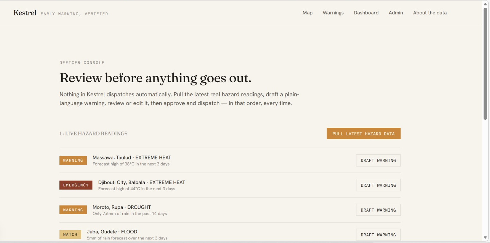
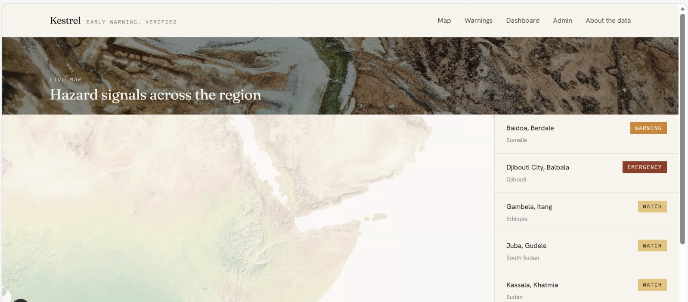
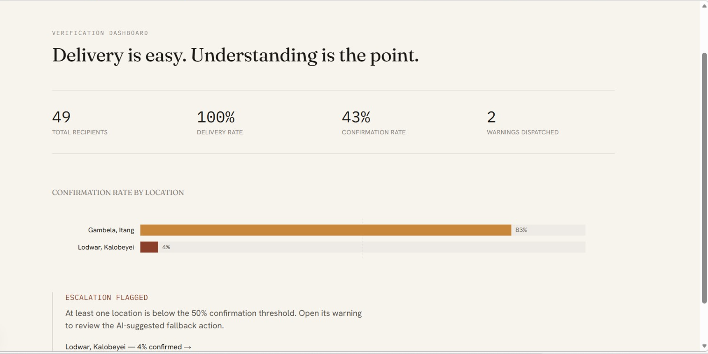
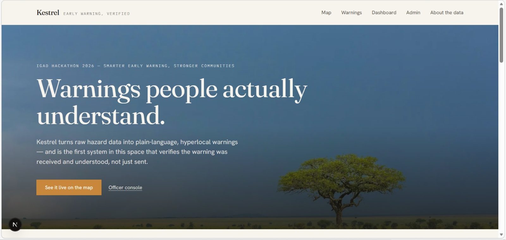
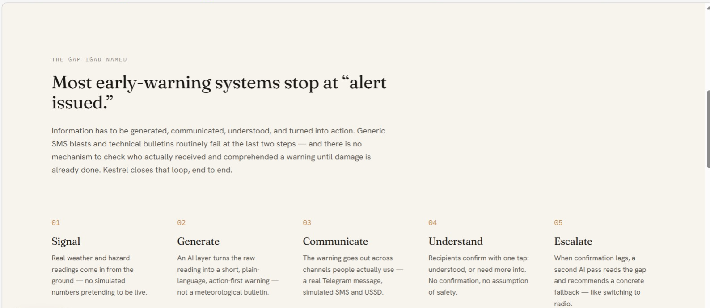
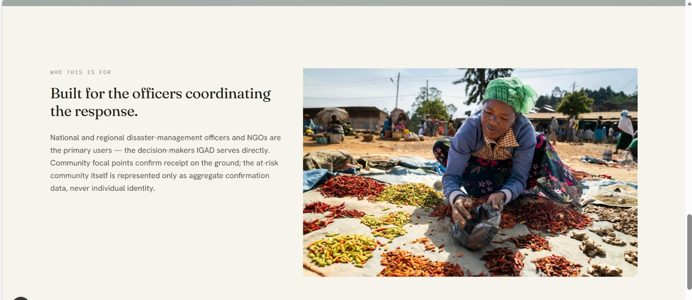
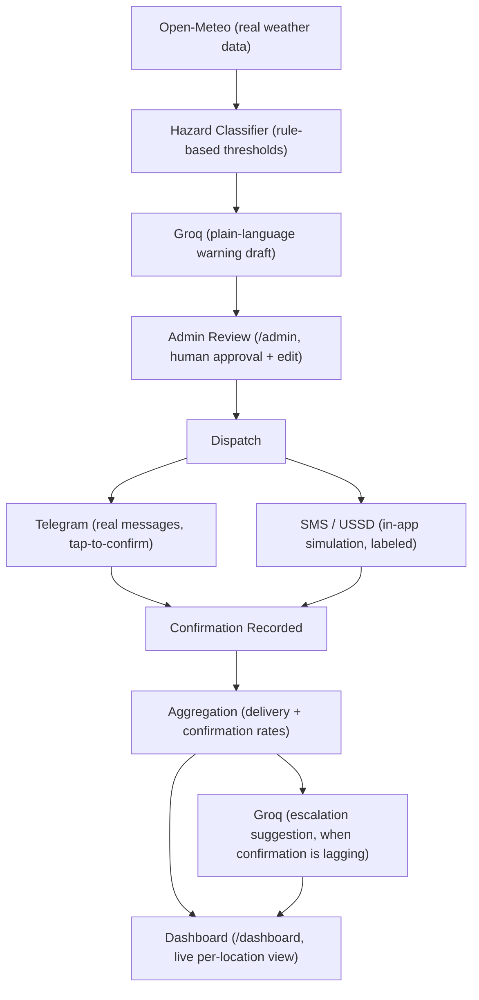

# KESTREL
### Early Warning That Proves It Was Understood


-2E7A57?style=flat-square&labelColor=141311)


> Most early-warning systems stop at delivery. Kestrel proves comprehension. A hazard reading becomes a plain-language warning, a human officer approves it, a real recipient receives and taps to confirm they understood it, and a live dashboard shows exactly where that understanding is failing, before the damage is done.

---

## Product Screenshots

Real captures from the running app, taken against live data (real hazard signals, real Groq output, real dashboard numbers), not mockups.

| Officer console | Live map |
|---|---|
|  |  |

| Verification dashboard | Landing page |
|---|---|
|  |  |

| The core loop | Who this is for |
|---|---|
|  |  |

---

## Live Links

| Resource | Link |
|---|---|
| **Live site** | [kestrel-pi.vercel.app](https://kestrel-pi.vercel.app) |
| **Admin console** | [kestrel-pi.vercel.app/admin](https://kestrel-pi.vercel.app/admin) |
| **Verification dashboard** | [kestrel-pi.vercel.app/dashboard](https://kestrel-pi.vercel.app/dashboard) |
| **Telegram bot** | [@kestrel001_Bot](https://t.me/kestrel001_Bot) |
| **GitHub** | [github.com/0xkinno/kestrel](https://github.com/0xkinno/kestrel) |
| **Hackathon** | IGAD Hackathon 2026, Smarter Early Warning, Stronger Communities |

---

## The problem

IGAD's own brief names the real gap in early warning: information has to be generated, communicated, understood, and turned into action. Most systems stop at the third step. A flood bulletin goes out as a technical SMS blast, in the wrong language or literacy level, and there is no mechanism to check whether anyone actually understood it until the damage is already done. Kestrel is built specifically for the two steps everyone else skips: proving understanding, and knowing what to do when that understanding does not happen fast enough.

---

## What makes Kestrel different

1. **Human-in-the-loop, not full automation.** Every warning is drafted by AI but held at `/admin` for a disaster-management officer to review, edit, and approve before dispatch. Nothing reaches a recipient without a human decision in the path, a deliberate design choice for a life-safety product.
2. **Verified comprehension, not just delivery.** Real recipients confirm receipt through an actual Telegram bot with tap-to-confirm buttons (Understood or Need more info), not a simulated read receipt. That confirmation is what most competing systems never build.
3. **Transparent hazard classification.** Severity (WATCH, WARNING, EMERGENCY) comes from documented, auditable rule-based thresholds over real weather data, not an opaque AI judgment call. The rules live in [`src/lib/hazardRules.ts`](src/lib/hazardRules.ts) and can be read and checked line by line.

---

## System architecture



### Request lifecycle, step by step

```
  officer                 engine                      recipient
    |  pull hazard data     |                              |
    | ---------------------> |                              |
    |                       |  fetch Open-Meteo ---------> |
    |                       | <----- real readings -------- |
    |                       |  classify severity            |
    |  draft warning         |                              |
    | ---------------------> |                              |
    |                       |  call Groq ------------------> |
    |                       | <----- plain-language draft -- |
    |  review, edit, approve |                              |
    | ---------------------> |                              |
    |  dispatch               |                              |
    | ---------------------> |                              |
    |                       |  send Telegram message -----------------------> |
    |                       |  create simulated SMS/USSD dispatch records     |
    |                       |                              |  tap Understood /
    |                       |                              |  Need more info
    |                       | <---------------------------------------------- |
    |                       |  record confirmation           |
    |  view dashboard         |                              |
    | ---------------------> |                              |
    |                       |  if confirmation rate < 50%:  |
    |                       |  call Groq for escalation      |
    |                       | <----- suggested fallback ---- |
    |  see escalation flag    |                              |
    | <--------------------- |                              |
```

---

## Core loop

One loop, several surfaces. Every capability answers a different question about the same warning.

| Surface | Function | What it answers |
|---|---|---|
| `/admin` | Pull real hazard data, review, edit, and approve drafted warnings | Should this warning go out, and does it say the right thing? |
| `/api/hazards/refresh` | Fetch real Open-Meteo data and apply rule-based severity thresholds | What is the current hazard level at each seeded location? |
| `/api/warnings/generate` | Groq drafts a plain-language, action-first warning from a hazard signal | What should this reading say to someone with low literacy, on a basic phone? |
| `/api/warnings/[id]/dispatch` | Fan out to Telegram (real) and simulated SMS/USSD | Did delivery actually go out, and through which channel? |
| `/api/telegram/webhook` | Receive real tap-to-confirm responses from Telegram | Did this specific person receive and confirm it? |
| `/api/warnings/[id]/stats`, `/dashboard` | Aggregate delivery and confirmation rates per location, live | Where is comprehension lagging, right now? |
| `/api/warnings/[id]/escalate` | Groq reasons over the real confirmation gap | What should we do about it? |

---

## Repository layout

```
kestrel/
├── prisma/
│   ├── schema.prisma            # Location, HazardSignal, Warning, Recipient, Dispatch, Confirmation, EscalationSuggestion
│   └── seed.ts                  # seeds 8 real IGAD locations + simulated recipient pool
├── src/
│   ├── app/
│   │   ├── page.tsx              # landing
│   │   ├── map/page.tsx          # live MapLibre map
│   │   ├── warnings/             # editorial feed + detail view
│   │   ├── dashboard/page.tsx    # D3 verification dashboard
│   │   ├── admin/page.tsx        # officer review console
│   │   ├── about-data/page.tsx   # in-app data transparency page
│   │   └── api/
│   │       ├── hazards/refresh/route.ts
│   │       ├── locations/route.ts
│   │       ├── warnings/generate/route.ts
│   │       ├── warnings/[id]/{approve,dispatch,simulate,stats,escalate,timeline}/route.ts
│   │       ├── telegram/{setup,webhook}/route.ts
│   │       └── dashboard/summary/route.ts
│   ├── components/
│   │   ├── SeverityBadge.tsx
│   │   ├── ChannelBadge.tsx
│   │   ├── ScrollReveal.tsx
│   │   ├── MapView.tsx
│   │   └── charts/{RegionComparisonChart,CumulativeConfirmationChart}.tsx
│   └── lib/
│       ├── openMeteo.ts          # real weather client
│       ├── hazardRules.ts        # rule-based severity thresholds
│       ├── groq.ts               # warning generation + escalation prompts
│       ├── telegram.ts           # real Telegram Bot API client
│       ├── confirmations.ts      # shared confirmation-recording logic
│       ├── warningStats.ts       # delivery/confirmation aggregation
│       └── locations.ts          # seeded IGAD location data
├── ATTRIBUTIONS.md
├── image-prompts.md
├── PROGRESS.md
├── SUBMISSION.md
├── DEMO_SCRIPT.md
└── README.md
```

---

## Quick start

Requirements: Node 20+, a Postgres connection string, a Groq API key, a Telegram bot token.

```bash
# 1. install dependencies
npm install

# 2. copy the env template and fill in your keys
cp .env.example .env

# 3. run the migration and seed real IGAD locations + simulated recipients
npx prisma migrate dev --name init
npm run db:seed

# 4. run the app (http://localhost:3000)
npm run dev
```

To test the real Telegram channel in local dev, expose your server with a tunnel, point `PUBLIC_BASE_URL` at that tunnel URL, then register the webhook:

```bash
curl -X POST http://localhost:3000/api/telegram/setup -H "x-admin-secret: $KESTREL_ADMIN_SECRET"
```

Message the bot `/start` to register as a real recipient.

---

## Data & AI disclosure

Every dataset, API, and model this build depends on, disclosed in full per the hackathon's transparency rule. Also visible in-app at `/about-data`.

| Layer | Source | Real or simulated |
|---|---|---|
| Weather data | Open-Meteo | Real, live |
| Hazard classification | Rule-based thresholds (`src/lib/hazardRules.ts`) | Real, deterministic, auditable |
| Warning generation | Groq (`llama-3.3-70b-versatile`) | Real |
| Telegram delivery | Telegram Bot API | Real |
| SMS / USSD delivery | In-app simulation | Simulated, labeled in UI as such |
| Escalation suggestion | Groq (`llama-3.3-70b-versatile`) | Real |
| Map tiles | MapLibre GL JS + OpenFreeMap | Real, no API key |
| Photography | Unsplash | Real, open-license, attributed in `ATTRIBUTIONS.md` |

Two disclosed substitutions from the original build brief: Groq is used in place of the Anthropic API, and Next.js 16 is used in place of the brief's suggested Next.js 14 (same framework and paradigm, a newer stable release).

---

## Why Kestrel excels

Mapped to the hackathon's own judging criteria.

| Criterion | Weight | How Kestrel delivers |
|---|---|---|
| Technical Depth & Engineering | 30% | A real Postgres schema modeling the full loop end to end (`Location → HazardSignal → Warning → Dispatch → Confirmation → EscalationSuggestion`), a real Telegram bot with webhook-driven confirmation, and a rule-based classifier that is fully readable, not a black box. |
| Innovation & AI Creativity | 30% | Two distinct AI touchpoints: one drafts the warning, a second reasons over live delivery data to recommend a concrete escalation action, the verification-and-escalation loop most competing systems do not attempt. |
| Problem Value & Impact | 25% | Built directly against IGAD's own stated gap of generate, communicate, understand, act, with a human officer held in the loop at every dispatch. |
| Presentation & Documentation | 15% | This README, `/about-data` in-app transparency, `ATTRIBUTIONS.md`, `PROGRESS.md`, and a timed demo script, all cross-checked against the real running build rather than written from a plan. |

---

## Tech stack

| Layer | Technology |
|---|---|
| Frontend | Next.js 16.2.11 (App Router), TypeScript, Tailwind v4 as a utility layer over a fully custom design system |
| Maps | MapLibre GL JS 6, OpenFreeMap tiles, restyled at runtime |
| Charts | D3.js 7, hand-built (region comparison, cumulative confirmation) |
| AI | Groq SDK (`llama-3.3-70b-versatile`), warning generation and escalation reasoning |
| Weather data | Open-Meteo, no API key |
| Database | PostgreSQL, Prisma ORM 7 with the `@prisma/adapter-pg` driver adapter |
| Real delivery channel | Telegram Bot API, inline tap-to-confirm buttons, webhook receiver |
| Simulated channels | In-app SMS/USSD simulation, labeled throughout the UI |
| Motion | Framer Motion, restrained scroll-triggered reveals |
| Fonts | Fraunces, Hanken Grotesk, IBM Plex Mono (Google Fonts, disclosed substitutes for the brief's suggested paid fonts) |

---

## Status

Every phase of the build spec has been implemented, verified live, and deployed, not just written and inspected as code.

- Real Open-Meteo readings pulled for all 8 seeded locations, producing real hazard signals (including an EMERGENCY drought signal for Lodwar, Kenya and a WATCH flood signal for Gambela, Ethiopia).
- Real Groq-generated warnings, reviewed and approved through `/admin`, with a single-warning-per-hazard-signal guard enforced at the database level to prevent duplicate drafts.
- A real message sent through the Telegram bot [@kestrel001_Bot](https://t.me/kestrel001_Bot), received, tapped, and correctly recorded in that warning's live confirmation stats.
- The verification dashboard showing real per-location confirmation rates and correctly flagging a location below the 50% escalation threshold.
- A real Groq-generated escalation suggestion, produced from the actual confirmation numbers.
- Pushed to a public GitHub repository and deployed to Vercel at [kestrel-pi.vercel.app](https://kestrel-pi.vercel.app), with the Telegram webhook re-pointed at the stable production URL.

Built for the IGAD Hackathon 2026.
